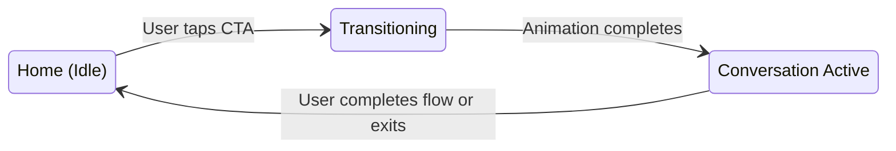
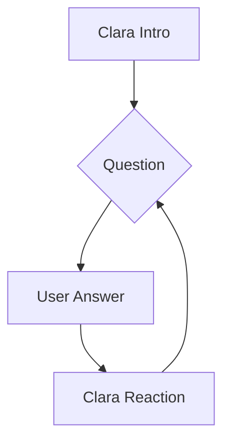

# Pathlight Home → Clara Conversational Experience
## Design & Interaction Model (v2)

**Version:** 2.0  
**Last Updated:** 2026-01-04  
**North Star:** "Build this so it feels like the home screen turns into a guided conversation—not like we added a chat feature."

---

## 1. Core Interaction Model: State Transition, Not Navigation

The fundamental principle is that the user never leaves the homepage. Instead, the UI transitions through three primary states, managed within a single view (`Index.tsx`).

### UI States (`HomeUIState`)

1.  **`idle`**: The default homepage view. All content is visible, featuring a single, supportive primary CTA.
2.  **`transitioning`**: A brief (250-400ms) animation state triggered by the CTA tap. The home content softly fades and blurs, while the conversational container emerges.
3.  **`conversation_active`**: The home content is now in the background, and the conversational container is the primary focus for the user.

This model eliminates route changes (`/onboarding-clara` is no longer needed) and preserves the feeling of a single, evolving experience.



---

## 2. Homepage (`idle` state)

### File: `frontend/src/pages/Index.tsx`

#### Requirements Checklist:

-   [x] **Single Primary CTA:** The goal selection cards will be removed from the initial view. The page will feature one primary CTA.
-   [x] **Supportive Copy:** The CTA copy will be updated to imply guidance.
    -   **Suggestion:** "Let's take the next step together"
-   [x] **No "Chat" Language:** All references to "chat" or "AI chat" will be removed. Chat icons (speech bubbles) are forbidden.

#### Proposed `Index.tsx` Structure (`idle` state):

```
┌─────────────────────────────────────────────────────────────┐
│                         HEADER                               │
│  [PathLight Logo] PathLight                                 │
└─────────────────────────────────────────────────────────────┘
│                                                              │
│                      HERO SECTION                            │
│  "See your clearest path out of debt."                      │
│                                                              │
├─────────────────────────────────────────────────────────────┤
│                   MEET CLARA CARD                            │
│  [Avatar] "Meet Clara, Your AI Money Advisor"               │
├─────────────────────────────────────────────────────────────┤
│                   PRIMARY CTA                                │
│                                                              │
│      [Let’s take the next step together →]                  │
│                                                              │
├─────────────────────────────────────────────────────────────┤
│                    TRUST BAR                                 │
└─────────────────────────────────────────────────────────────┘
```

---

## 3. The Transition (`transitioning` state)

This is a purely visual state managed by CSS and component state.

### Animation Requirements:

-   **Duration:** `300ms`
-   **Easing:** `ease-in-out`
-   **Home Content:** `opacity` reduces to `0.2`, `filter: blur(8px)` is applied.
-   **Conversational Container:** Rises from the bottom of the viewport and settles into place. `transform: translateY(100%)` to `translateY(0)`.

This creates a calm, intentional motion that shifts the user's focus without an abrupt context switch.

---

## 4. Conversational Container (`conversation_active` state)

This container is embedded within `Index.tsx` and becomes visible during the transition.

### Structural Requirements:

-   [x] **Embedded in Home:** It is not a modal or a separate page.
-   [x] **Vertically Stacked:** Messages appear one after another.
-   [x] **No Chat Chrome:**
    -   No header (e.g., "Chat with Clara").
    -   No avatars (per v1 requirements).
    -   No timestamps.
    -   **CRITICAL:** No typing indicators. This is a guided flow, not a live chat.

### Conversation Flow States (`ConversationState`)

The flow within the container is strictly controlled:

1.  **`intro`**: Clara's warm, non-question intro message appears automatically.
2.  **`question`**: The first system-rendered onboarding question appears, voiced as Clara.
3.  **`user_answer`**: The user selects their answer. Input controls are only visible during this state.
4.  **`ai_reaction`**: The user's answer is displayed, and Clara's AI-generated empathetic reaction appears below it. The flow then loops back to `question` for the next item.



---

## 5. Guide-Voiced Questions vs. AI Reactions

This is the most critical clarification. The system is architected to separate question-asking from AI-generation.

### Clara's Voice (System-Controlled)

-   **Source:** `frontend/src/lib/onboardingQuestions.ts`
-   **Responsibility:** The frontend component renders these questions sequentially.
-   **Tone:** Written in the first-person plural ("Let's...", "How are we feeling..."). They *feel* like Clara is asking them.
-   **Appearance:** Visually distinct from Clara's reactions but not form-like. A softer, slightly indented container could work.

### Clara's Reactions (AI-Generated)

-   **Source:** `POST /api/v1/ai/onboarding-reaction` endpoint.
-   **Responsibility:** The AI generates an empathetic, non-questioning statement based on the user's answer.
-   **Hard Constraint:** The backend prompt and model are forbidden from asking questions. This is a core safety rail.
-   **Appearance:** Standard message bubble style.

**The user experiences a seamless dialogue, unaware of the technical separation. This achieves the goal: "The system runs the intake. Clara owns the conversation."**

---

## 6. State Management Plan

### Component State (`Index.tsx`)

```typescript
// In Index.tsx
const [uiState, setUiState] = useState<'idle' | 'transitioning' | 'conversation_active'>('idle');
```

This single state atom will control the visibility and animations of the home content vs. the conversational container.

### Conversation State (`useConversationalFlow.ts`)

The existing `useConversationalFlow` hook is well-suited but will be adapted:
- It will no longer be tied to a specific page (`OnboardingClara.tsx`).
- It will manage the `ConversationState` (`intro`, `question`, etc.).
- It will persist its state to `sessionStorage` to handle session resumes.

### Session Resume

-   If `sessionStorage` contains an active conversation state, the app will initialize directly into the `conversation_active` UI state.
-   The `useConversationalFlow` hook will trigger the `is_resume` flag in its first API call, allowing Clara to provide the "Welcome back!" reaction.

---

## 7. Feedback and Review

This is a very strong and well-defined interaction model. It successfully avoids the pitfalls of generic "chatbot" implementations and creates a unique, brand-aligned experience.

**Strengths:**
*   **Product-Led:** The focus on the *feeling* of the interaction is paramount.
*   **Clear Constraints:** The "Explicitly Avoid" sections are incredibly helpful for preventing design and engineering drift.
*   **Technical Feasibility:** The proposed state-transition model is achievable with modern frontend frameworks (React, Vue, Svelte) without significant architectural overhead.
*   **Scalability:** The separation of system-driven questions from AI-driven reactions is a robust pattern that allows for future expansion without compromising the core experience.

**Potential Challenges & Recommendations:**
*   **Visual Design of Questions:** The requirement for questions to be "visually distinct... but not system-like" is a nuanced design challenge. I recommend prototyping a few options, perhaps using indentation or a subtle background variation to differentiate them from Clara's reactions while maintaining a cohesive feel.
*   **Accessibility:** The focus shift to the conversational container is good. We must ensure that screen readers announce the transition clearly (e.g., "Homepage content hidden. Starting conversation with Clara.").
*   **Performance:** The background blur can be performance-intensive. It should be tested on a range of devices. A simple opacity fade may be sufficient and more performant.

This updated model is a significant step forward and directly addresses the new requirements. The next steps you outlined (sample copy, component map, QA checklist) are the perfect way to move this from architectural plan to implementation-ready specification.